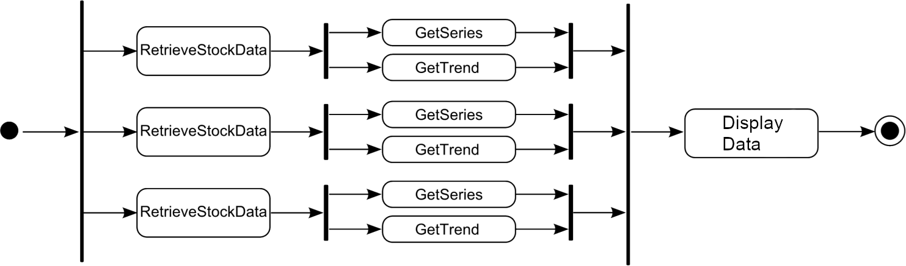

# VPS5 - Exercise 5
---

## 1. Stock Data Visualization

Web requests can often be executed asynchronously to improve the responsiveness of an application and to reduce the total response time of multiple requests. In this repository we provide a sequential implementation of a stock data visualization program that fetches price histories of three stocks and shows them in a line chart.

**Task 1.a (6 Points):**  
Implement an asynchronous version of the stock data visualization program using the .NET Task Parallel Library. Your version should execute tasks as shown in the following activity diagram.
Use continuations to create chains of several tasks.

**Task 1.b (6 Points):**  
Implement a second version of the stock data visualization program which uses the keywords async and await. Make sure the tasks are again modeled as shown in the activity diagram.

## 2. Parallel Wator

Implement a parallel version of the Wator simulation from the first exercise using the .NET Task Parallel Library. You can parallelize either your already optimized version or the original version.

**Task 2.a (8 Points):**  
Think about how you can separate data and work of the Wator simulation to allow parallel processing and consider appropriate synchronization. Describe and implement your decomposition and parallelization concept and explain your approach and its advantages and maybe also disadvantages.

**Task 2.b (4 Points):**  
Test your parallel Wator simulation, compare its runtime with your optimized version and the original version and calculate the speedup.
